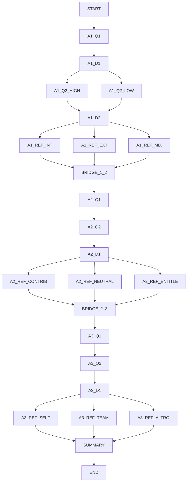

```mermaid
flowchart TD

START --> A1_Q1
A1_Q1 --> A1_D1
A1_D1 --> A1_Q2_HIGH
A1_D1 --> A1_Q2_LOW

A1_Q2_HIGH --> A1_D2
A1_Q2_LOW --> A1_D2

A1_D2 --> A1_REF_INT
A1_D2 --> A1_REF_EXT
A1_D2 --> A1_REF_MIX

A1_REF_INT --> BRIDGE_1_2
A1_REF_EXT --> BRIDGE_1_2
A1_REF_MIX --> BRIDGE_1_2

BRIDGE_1_2 --> A2_Q1
A2_Q1 --> A2_Q2
A2_Q2 --> A2_D1

A2_D1 --> A2_REF_CONTRIB
A2_D1 --> A2_REF_NEUTRAL
A2_D1 --> A2_REF_ENTITLE

A2_REF_CONTRIB --> BRIDGE_2_3
A2_REF_NEUTRAL --> BRIDGE_2_3
A2_REF_ENTITLE --> BRIDGE_2_3

BRIDGE_2_3 --> A3_Q1
A3_Q1 --> A3_Q2
A3_Q2 --> A3_D1

A3_D1 --> A3_REF_SELF
A3_D1 --> A3_REF_TEAM
A3_D1 --> A3_REF_ALTRO

A3_REF_SELF --> SUMMARY
A3_REF_TEAM --> SUMMARY
A3_REF_ALTRO --> SUMMARY

SUMMARY --> END
```